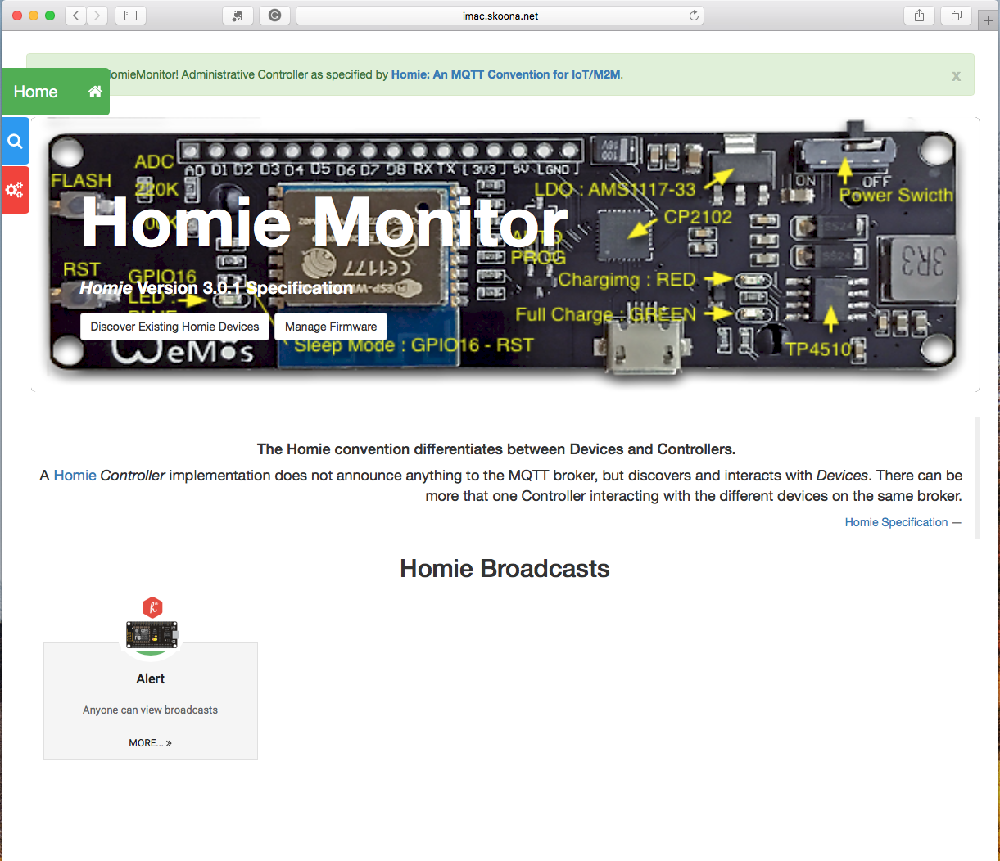
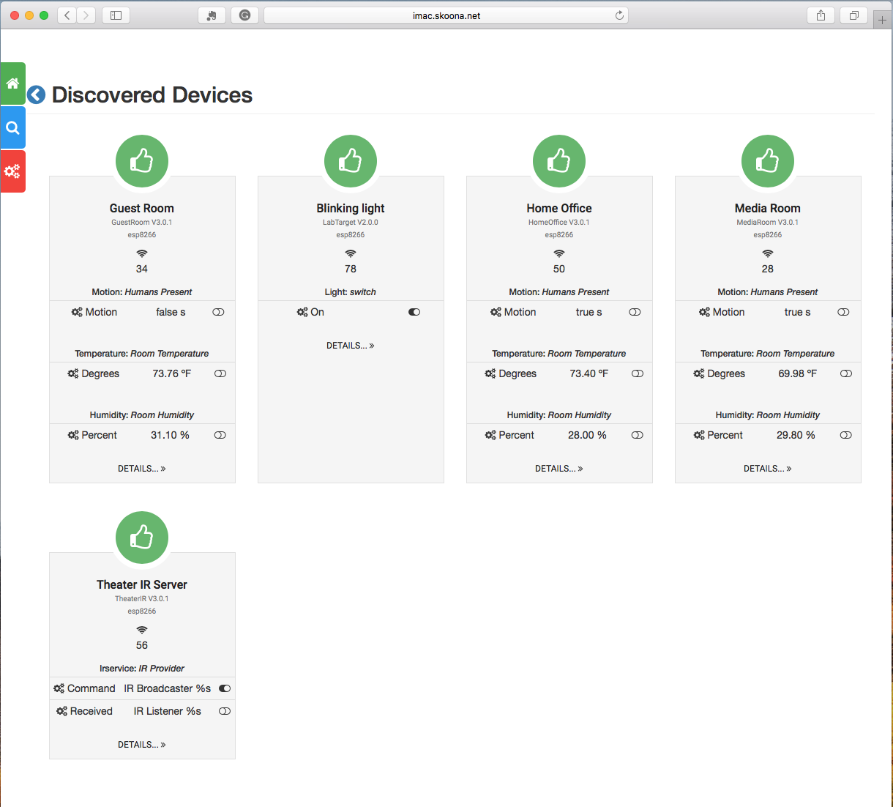
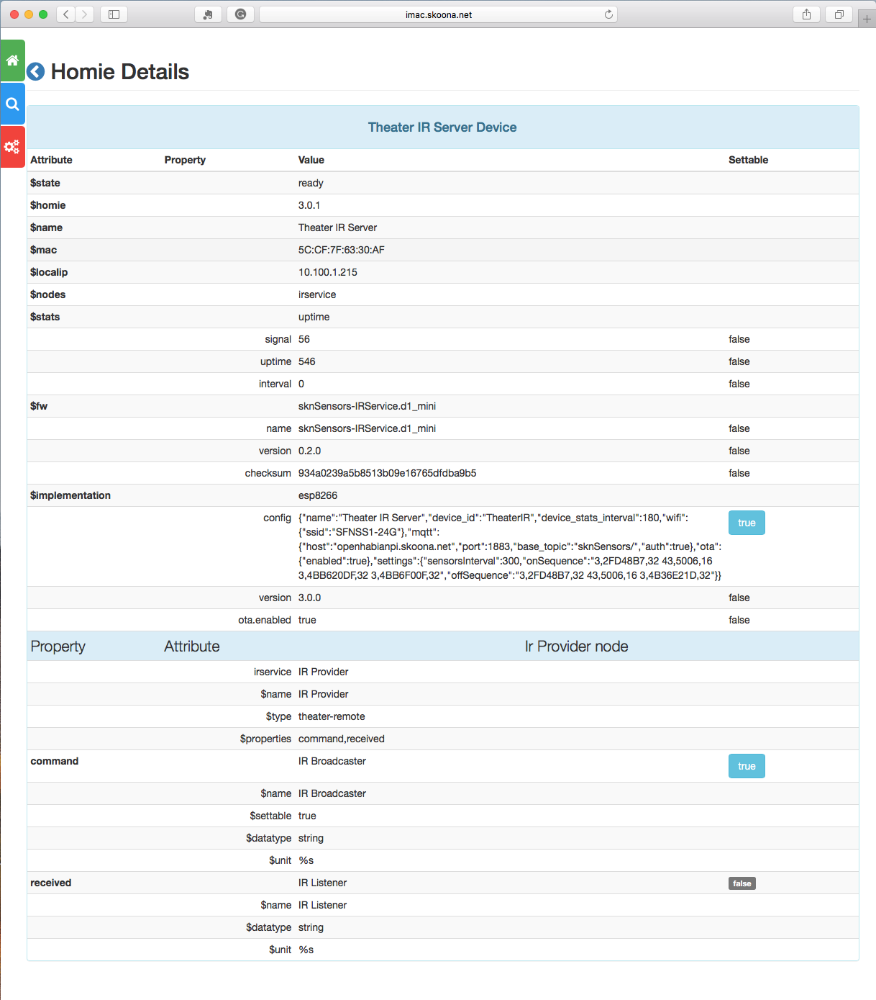
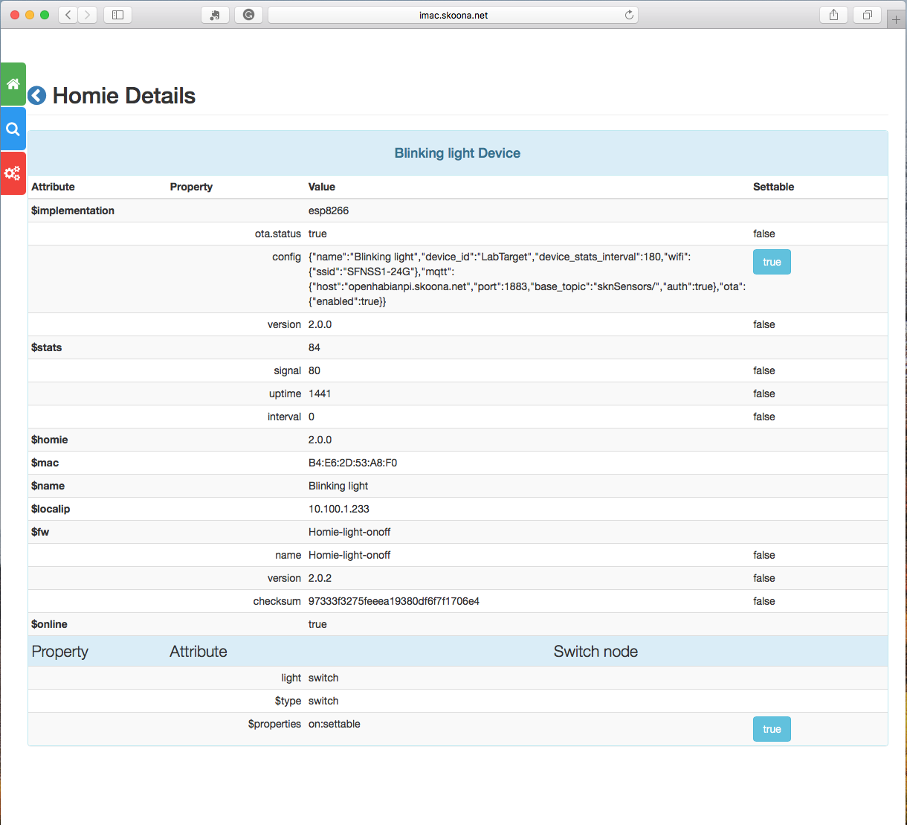
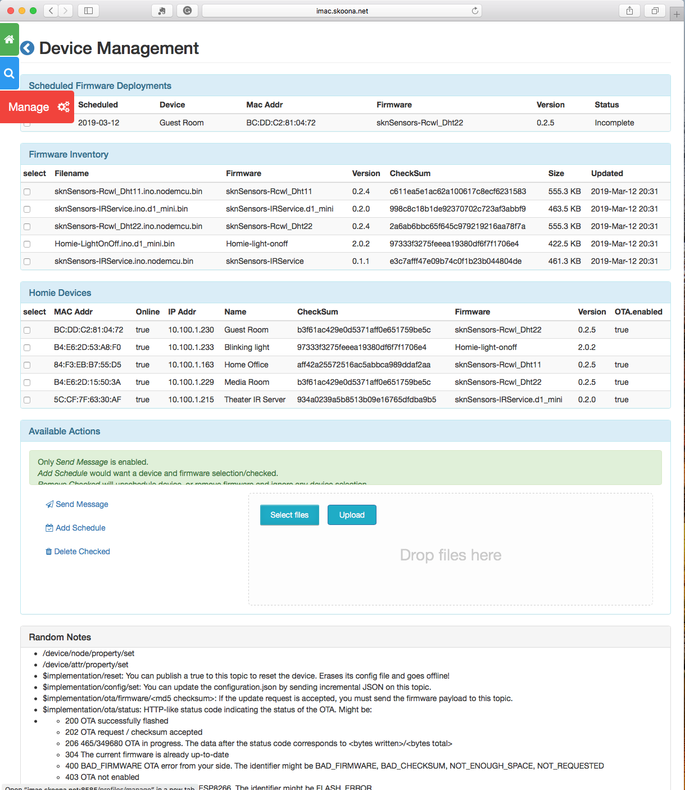
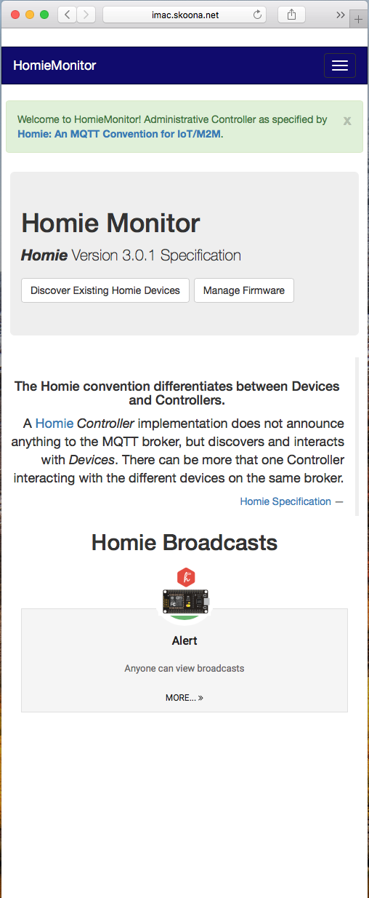
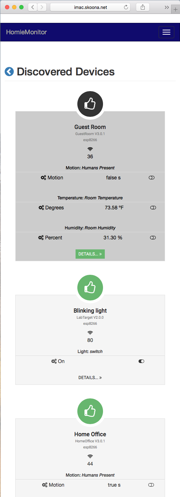

# HomieMonitor
An exploration into [Homie-esp8266](https://homieiot.github.io/homie-esp8266/docs/develop/quickstart/getting-started/), using modules from [Dry-RB](http://dry-rb.org), 
[Paho.MQTT.Ruby](https://github.com/RubyDevInc/paho.mqtt.ruby), [JRuby](https://www.jruby.org) and 
[Roda](https://github.com/jeremyevans/roda) tooling.  This application is designed to act as a `Homie Controller`, or `Monitor`, 
in support of IOT/Devices using [Homie-esp8266](https://github.com/homieiot/homie-esp8266); although any `Homie Device` implementation should be supported.


#### References: 
* [Homie: An MQTT Convention for IOT/M2M](https://homieiot.github.io/specification/)
* [Homie-ESP8266 Example of RCWL-0516 Microwave Presence Detector and DHT22 Temperature and Humidity sensors](https://github.com/skoona/sknSensors-Rcwl_Dht22)

### WIP: Comments
The plan is to use JRuby and build an executable, and self-contained, Java Jar that will run on any OS.  Today it works with either MRI or JRuby.

Ruby's Standard Library offers YAML::Store as a key/value datasource, based on readable yaml files, this appears to be a good fit as most data is dynamically discovered.  Also, with a few gemfile tweaks you could use MRI/Ruby vs JRuby; only the Javascript engine needs to be changed.


      
 
## Planned Features
#### Primary
* Monitor Homie V2, and V3 Devices (Initial Focus on `ESP8266`)
* Controller model for Esp8266 devices
* MQTT OTA operations
* HTTP Arduino OTA

#### Secondary
* Self contained Application packaged as one/in Java Executable Jarfile; using Warbler.gem -- port 8080
* Internally designed to tollerate potentially Homie Specification 1.5+, but focused on V3.


## Demonstration Mode
If you do not have a MQTT Broker accessable, it is possible to use a mock mqtt stream.  Edit/create
your `./config/settings/development.local.yml` file and add the following starting at line 0 or 1:

    ---
    Packaging:
      short_name: esp
    
    content_service:
      demo_mode: true
    
    # ##
    # Override (restate) by development, stage, production, etc
    mqtt:
      debug_log_file: './log/paho.log'


The `content_service` entry controls which mqtt stgream is used; live or mocked.  You can find the 
source files for the mock in directory: `./spec/factories/homie_*.txt`.  The class which transform these 
text entries into mqtt messages is `./main/homie/handlers/mock_stream.rb`

However, if MQTT `host` has not been configured, `demo_mode` will default to true!


## File Tree
<details><summary>Application File Tree</summary>
<p>

    [HomieMonitor]
        .
        ├── config.ru               - Rack Initializer
        ├── Gemfile                 - Gem Requirements
        ├── assets
        │   ├── stylesheets/        - Sass based CSS
        │   └── javascript/         - JQuery, BootStrap, and general Javascript
        ├── bin
        │   ├── console             - Command line console [app|web] defaults web
        │   └── setup               - One-time installer script
        ├── config
        │   ├── initializers/       - SknApp, SknSettings, and Logging are initialized here
        │   │   ├── 00-init_skn_configurable.rb
        │   │   ├── 01-init_skn_configuraiton.rb
        │   │   ├── 02-init_logging.rb
        │   │   └── 04-init_mqtt_modules.rb
        │   ├── settings/           - SknSettings Environment-biased Application Settings
        │   │   ├── development.local.yml  -- you need to create this non-git file and set local passwords, etc.
        │   │   ├── development.yml
        │   │   ├── production.yml
        │   │   └── test.yml    
        │   ├── puma.rb             - Puma local webserver
        │   ├── settings.yml        - Default Application Settings
        │   ├── version.rb          - Application Version Object
        │   ├── environment.rb      - Loads Gems and Initializers Only
        │   ├── boot_web.rb         - Load Main and Web Application components
        │   └── boot.rb             - Load Main Application Only
        ├── content/                 
        │   ├── firmwares/          - Firmware Storage
        │   └── spiffs/             - SPIFFS Storage
        ├── db                      - Default storage location for YAML::Store
        ├── i18n/                   - Message Translation files
        ├── main                    - Business UseCases and Integrations
        │   ├── homie/              - Homie V3 modules
        │   │   ├── commands
        │   │   │   ├── queue_event.rb
        │   │   │   └── commands.rb
        │   │   ├── component
        │   │   │   ├── attribute.rb
        │   │   │   ├── component.rb
        │   │   │   ├── device.rb
        │   │   │   ├── events.rb
        │   │   │   ├── firmware.rb
        │   │   │   ├── node.rb
        │   │   │   └── property.rb
        │   │   ├── handlers
        │   │   │   ├── action.rb
        │   │   │   ├── handlers.rb
        │   │   │   ├── stream.rb      - MQTT Handlers using Paho-Ruby
        │   │   │   └── mock_stream.rb - Populates Queues from test data
        │   │   ├── homie.rb
        │   │   └── manager.rb
        │   ├── services/           - API services and ServicesRegistry
        │   │   ├── commands/       - Handler commands for API content requests
        │   │   ├── handlers/       - IO Handler
        │   │   │   ├── ...
        │   │   │   └── stream.rb   - Homie Device View Data handler
        │   │   ├── providers/      - Business Requests
        │   │   ├── services_registry.rb  - Web Interface to Primary Application
        │   │   └── services.rb     - Require management and Service registrations
        │   ├── utils/              - Application Utilities
        │   └── main.rb             - LoadPath Management
        ├── public
        │   ├── images/             - View Images
        │   └── fonts/              - View Fonts
        ├── rakelib/                - Rake Tasks
        ├── spec/                   - RSpec Tests
        └── web                     - Primary Web Integration
            ├── helpers/            - View HTML Helpers/Wrappers
            ├── routes
            │   ├── profiles.rb     - Profile Routes
            │   └── homie.rb        - Firmware Routes
            └── views
                ├── layouts/        - Site Layout
                ├── profiles/       - Profile Pages
                │   ├── devices.html.erb  - Discovered Devices Page
                │   ├── details.html.erb  - Device In-Depth Homie Details
                │   └── manage.html.erb   - Homie Device Management Page
                ├── ...                   - Root Pages
                └── homepage.html.erb     - Homie Broadcasts Page


</p>
</details>


## Output from RSpec HomieManager module test
using V3.01 test data with four devices, mixed 
* One Device, one-node multiple-properties, 
* One Device, three-nodes one-property-per-node
* see `./spec/factories` and `./spec/support` for test data
    * `$  mosquitto_sub -v -h hostname -t homie/#  -u username -P password`
    * Above wil produce a console log that can be used as test data by this system.

<details><summary>Discovery Outcome</summary>
<p>

```text
Homie::Manager Homie Discovery Provider.
  Discovery Outcome
Device: HomeOffice:Home Office 	Nodes ~> 3
	(A) $state:ready 	Properties: 0
	(A) $homie:3.0.1 	Properties: 0
	(A) $name:Home Office 	Properties: 0
	(A) $mac:84:F3:EB:B7:55:D5 	Properties: 0
	(A) $localip:10.100.1.163 	Properties: 0
	(A) $nodes:motion,temperature,humidity 	Properties: 0
	(A) $stats:uptime 	Properties: 3
		(P) interval:0 
		(P) signal:42 
		(P) uptime:409276 
	(A) $fw:sknSensors-Rcwl_Dht11 	Properties: 3
		(P) name:sknSensors-Rcwl_Dht11 
		(P) version:0.2.5 
		(P) checksum:aff42a25572516ac5abbca989ddaf2aa 
	(A) $implementation:esp8266 	Properties: 3
		(P) config:{"name":"Home Office","device_id":"HomeOffice","device_stats_interval":180,"wifi":{"ssid":"SFNSS1-24G"},"mqtt":{"host":"openhabianpi.skoona.net","port":1883,"base_topic":"sknSensors/","auth":true},"ota":{"enabled":true},"settings":{"sensorsInterval":300}} 
		(P) version:3.0.0 
		(P) ota.enabled:true 
	Node: motion:Humans Present 	Properties: 1
		(A) $name:Humans Present 
		(A) $type:motion 
		(A) $properties:motion 
		(P) motion:true 	Attributes: 3
			(A) $name:Motion 
			(A) $datatype:boolean 
			(A) $unit:s 
	Node: temperature:Room Temperature 	Properties: 1
		(A) $name:Room Temperature 
		(A) $type:temperature 
		(A) $properties:degrees 
		(P) degrees:69.80 	Attributes: 3
			(A) $name:Degrees 
			(A) $datatype:float 
			(A) $unit:ºF 
	Node: humidity:Room Humidity 	Properties: 1
		(A) $name:Room Humidity 
		(A) $type:humidity 
		(A) $properties:percent 
		(P) percent:25.00 	Attributes: 3
			(A) $name:Percent 
			(A) $datatype:float 
			(A) $unit:% 

Device: TheaterIR:Theater IR Server 	Nodes ~> 1
	(A) $state:ready 	Properties: 0
	(A) $homie:3.0.1 	Properties: 0
	(A) $name:Theater IR Server 	Properties: 0
	(A) $mac:5C:CF:7F:63:30:AF 	Properties: 0
	(A) $localip:10.100.1.215 	Properties: 0
	(A) $nodes:irservice 	Properties: 0
	(A) $stats:uptime 	Properties: 3
		(P) interval:0 
		(P) signal:42 
		(P) uptime:245887 
	(A) $fw:sknSensors-IRService.d1_mini 	Properties: 3
		(P) name:sknSensors-IRService.d1_mini 
		(P) version:0.2.0 
		(P) checksum:934a0239a5b8513b09e16765dfdba9b5 
	(A) $implementation:esp8266 	Properties: 3
		(P) config:{"name":"Theater IR Server","device_id":"TheaterIR","device_stats_interval":180,
		            "wifi":{"ssid":"SFNSS1-24G"},
		            "mqtt":{"host":"openhabianpi.skoona.net","port":1883,"base_topic":"sknSensors/","auth":true},
		            "ota":{"enabled":true},
		            "settings":{"sensorsInterval":300,"onSequence":"3,2FD48B7,32 43,5006,16 3,4BB620DF,32 3,4BB6F00F,32","offSequence":"3,2FD48B7,32 43,5006,16 3,4B36E21D,32"}} 
		(P) version:3.0.0 
		(P) ota.enabled:true 
	Node: irservice:IR Provider 	Properties: 2
		(A) $name:IR Provider 
		(A) $type:theater-remote 
		(A) $properties:command,received 
		(P) command:IR Broadcaster 	Attributes: 4
			(A) $name:IR Broadcaster 
			(A) $settable:true 
			(A) $datatype:string 
			(A) $unit:%s 
		(P) received:IR Listener 	Attributes: 3
			(A) $name:IR Listener 
			(A) $datatype:string 
			(A) $unit:%s 
```

</p>
</details>

## Which represents this Hash!
<details><summary>Array of hashes for two Devices</summary>
<p>

```ruby
# Array of two Devices
# 
[{:klass=>"Device",
  :name=>"HomeOffice",
  :value=>"Home Office",
  :attributes=>
   [{:klass=>"Attribute", :name=>"$state", :value=>"ready", :properties=>[]},
    {:klass=>"Attribute", :name=>"$homie", :value=>"3.0.1", :properties=>[]},
    {:klass=>"Attribute",
     :name=>"$name",
     :value=>"Home Office",
     :properties=>[]},
    {:klass=>"Attribute",
     :name=>"$mac",
     :value=>"84:F3:EB:B7:55:D5",
     :properties=>[]},
    {:klass=>"Attribute",
     :name=>"$localip",
     :value=>"10.100.1.163",
     :properties=>[]},
    {:klass=>"Attribute",
     :name=>"$nodes",
     :value=>"motion,temperature,humidity",
     :properties=>[]},
    {:klass=>"Attribute",
     :name=>"$stats",
     :value=>"uptime",
     :properties=>
      [{:klass=>"Property", :name=>"interval", :value=>"0", :attributes=>[]},
       {:klass=>"Property", :name=>"signal", :value=>"42", :attributes=>[]},
       {:klass=>"Property",
        :name=>"uptime",
        :value=>"409276",
        :attributes=>[]}]},
    {:klass=>"Attribute",
     :name=>"$fw",
     :value=>"sknSensors-Rcwl_Dht11",
     :properties=>
      [{:klass=>"Property",
        :name=>"name",
        :value=>"sknSensors-Rcwl_Dht11",
        :attributes=>[]},
       {:klass=>"Property",
        :name=>"version",
        :value=>"0.2.5",
        :attributes=>[]},
       {:klass=>"Property",
        :name=>"checksum",
        :value=>"aff42a25572516ac5abbca989ddaf2aa",
        :attributes=>[]}]},
    {:klass=>"Attribute",
     :name=>"$implementation",
     :value=>"esp8266",
     :properties=>
      [{:klass=>"Property",
        :name=>"config",
        :value=>
         "{\"name\":\"Home Office\",\"device_id\":\"HomeOffice\",\"device_stats_interval\":180,\"wifi\":{\"ssid\":\"SFNSS1-24G\"},\"mqtt\":{\"host\":\"openhabianpi.skoona.net\",\"port\":1883,\"base_topic\":\"sknSensors/\",\"auth\":true},\"ota\":{\"enabled\":true},\"settings\":{\"sensorsInterval\":300}}",
        :attributes=>[]},
       {:klass=>"Property",
        :name=>"version",
        :value=>"3.0.0",
        :attributes=>[]},
       {:klass=>"Property",
        :name=>"ota.enabled",
        :value=>"true",
        :attributes=>[]}]}],
  :nodes=>
   [{:klass=>"Node",
     :name=>"motion",
     :value=>"Humans Present",
     :properties=>
      [{:klass=>"Property",
        :name=>"motion",
        :value=>"true",
        :attributes=>
         [{:klass=>"Attribute",
           :name=>"$name",
           :value=>"Motion",
           :properties=>[]},
          {:klass=>"Attribute",
           :name=>"$datatype",
           :value=>"boolean",
           :properties=>[]},
          {:klass=>"Attribute",
           :name=>"$unit",
           :value=>"s",
           :properties=>[]}]}],
     :attributes=>
      [{:klass=>"Attribute",
        :name=>"$name",
        :value=>"Humans Present",
        :properties=>[]},
       {:klass=>"Attribute",
        :name=>"$type",
        :value=>"motion",
        :properties=>[]},
       {:klass=>"Attribute",
        :name=>"$properties",
        :value=>"motion",
        :properties=>[]}]},
    {:klass=>"Node",
     :name=>"temperature",
     :value=>"Room Temperature",
     :properties=>
      [{:klass=>"Property",
        :name=>"degrees",
        :value=>"69.80",
        :attributes=>
         [{:klass=>"Attribute",
           :name=>"$name",
           :value=>"Degrees",
           :properties=>[]},
          {:klass=>"Attribute",
           :name=>"$datatype",
           :value=>"float",
           :properties=>[]},
          {:klass=>"Attribute",
           :name=>"$unit",
           :value=>"ºF",
           :properties=>[]}]}],
     :attributes=>
      [{:klass=>"Attribute",
        :name=>"$name",
        :value=>"Room Temperature",
        :properties=>[]},
       {:klass=>"Attribute",
        :name=>"$type",
        :value=>"temperature",
        :properties=>[]},
       {:klass=>"Attribute",
        :name=>"$properties",
        :value=>"degrees",
        :properties=>[]}]},
    {:klass=>"Node",
     :name=>"humidity",
     :value=>"Room Humidity",
     :properties=>
      [{:klass=>"Property",
        :name=>"percent",
        :value=>"25.00",
        :attributes=>
         [{:klass=>"Attribute",
           :name=>"$name",
           :value=>"Percent",
           :properties=>[]},
          {:klass=>"Attribute",
           :name=>"$datatype",
           :value=>"float",
           :properties=>[]},
          {:klass=>"Attribute",
           :name=>"$unit",
           :value=>"%",
           :properties=>[]}]}],
     :attributes=>
      [{:klass=>"Attribute",
        :name=>"$name",
        :value=>"Room Humidity",
        :properties=>[]},
       {:klass=>"Attribute",
        :name=>"$type",
        :value=>"humidity",
        :properties=>[]},
       {:klass=>"Attribute",
        :name=>"$properties",
        :value=>"percent",
        :properties=>[]}]}]},
 {:klass=>"Device",
  :name=>"TheaterIR",
  :value=>"Theater IR Server",
  :attributes=>
   [{:klass=>"Attribute", :name=>"$state", :value=>"ready", :properties=>[]},
    {:klass=>"Attribute", :name=>"$homie", :value=>"3.0.1", :properties=>[]},
    {:klass=>"Attribute",
     :name=>"$name",
     :value=>"Theater IR Server",
     :properties=>[]},
    {:klass=>"Attribute",
     :name=>"$mac",
     :value=>"5C:CF:7F:63:30:AF",
     :properties=>[]},
    {:klass=>"Attribute",
     :name=>"$localip",
     :value=>"10.100.1.215",
     :properties=>[]},
    {:klass=>"Attribute",
     :name=>"$nodes",
     :value=>"irservice",
     :properties=>[]},
    {:klass=>"Attribute",
     :name=>"$stats",
     :value=>"uptime",
     :properties=>
      [{:klass=>"Property", :name=>"interval", :value=>"0", :attributes=>[]},
       {:klass=>"Property", :name=>"signal", :value=>"42", :attributes=>[]},
       {:klass=>"Property",
        :name=>"uptime",
        :value=>"245887",
        :attributes=>[]}]},
    {:klass=>"Attribute",
     :name=>"$fw",
     :value=>"sknSensors-IRService.d1_mini",
     :properties=>
      [{:klass=>"Property",
        :name=>"name",
        :value=>"sknSensors-IRService.d1_mini",
        :attributes=>[]},
       {:klass=>"Property",
        :name=>"version",
        :value=>"0.2.0",
        :attributes=>[]},
       {:klass=>"Property",
        :name=>"checksum",
        :value=>"934a0239a5b8513b09e16765dfdba9b5",
        :attributes=>[]}]},
    {:klass=>"Attribute",
     :name=>"$implementation",
     :value=>"esp8266",
     :properties=>
      [{:klass=>"Property",
        :name=>"config",
        :value=>
         "{\"name\":\"Theater IR Server\",\"device_id\":\"TheaterIR\",\"device_stats_interval\":180,\"wifi\":{\"ssid\":\"SFNSS1-24G\"},\"mqtt\":{\"host\":\"openhabianpi.skoona.net\",\"port\":1883,\"base_topic\":\"sknSensors/\",\"auth\":true},\"ota\":{\"enabled\":true},\"settings\":{\"sensorsInterval\":300,\"onSequence\":\"3,2FD48B7,32 43,5006,16 3,4BB620DF,32 3,4BB6F00F,32\",\"offSequence\":\"3,2FD48B7,32 43,5006,16 3,4B36E21D,32\"}}",
        :attributes=>[]},
       {:klass=>"Property",
        :name=>"version",
        :value=>"3.0.0",
        :attributes=>[]},
       {:klass=>"Property",
        :name=>"ota.enabled",
        :value=>"true",
        :attributes=>[]}]}],
  :nodes=>
   [{:klass=>"Node",
     :name=>"irservice",
     :value=>"IR Provider",
     :properties=>
      [{:klass=>"Property",
        :name=>"command",
        :value=>"IR Broadcaster",
        :attributes=>
         [{:klass=>"Attribute",
           :name=>"$name",
           :value=>"IR Broadcaster",
           :properties=>[]},
          {:klass=>"Attribute",
           :name=>"$settable",
           :value=>"true",
           :properties=>[]},
          {:klass=>"Attribute",
           :name=>"$datatype",
           :value=>"string",
           :properties=>[]},
          {:klass=>"Attribute",
           :name=>"$unit",
           :value=>"%s",
           :properties=>[]}]},
       {:klass=>"Property",
        :name=>"received",
        :value=>"IR Listener",
        :attributes=>
         [{:klass=>"Attribute",
           :name=>"$name",
           :value=>"IR Listener",
           :properties=>[]},
          {:klass=>"Attribute",
           :name=>"$datatype",
           :value=>"string",
           :properties=>[]},
          {:klass=>"Attribute",
           :name=>"$unit",
           :value=>"%s",
           :properties=>[]}]}],
     :attributes=>
      [{:klass=>"Attribute",
        :name=>"$name",
        :value=>"IR Provider",
        :properties=>[]},
       {:klass=>"Attribute",
        :name=>"$type",
        :value=>"theater-remote",
        :properties=>[]},
       {:klass=>"Attribute",
        :name=>"$properties",
        :value=>"command,received",
        :properties=>[]}]}]}
]

```

</p>
</details>


## Following Along: Installation
No trouble for Mac/Linux systems. Don't know about Windows (don't have one).
<dl>
    <dt>Setup Application and Create Database Tables:</dt>
        <dd><code>$ bin/setup</code></dd>
    <dt>Start Server with Puma, Port 8585:</dt>
        <dd><code>$ bundle exec puma config.ru -v</code></dd>
    <dt>Start Server with RackUp, Port 9292:</dt>
        <dd><code>$ rackup</code></dd>
    <dt>Start Console with Pry:</dt>
        <dd><code>$ bin/console</code></dd>
</dl>

#### Helpful Environmental Vars
The configuration module will prefers environment variables over config file values.

    RACK_ENV            defaults to `'development'`
    HM_MQTT_HOST        defaults are invalid
    HM_MQTT_PORT        defaults to 1883
    HM_MQTT_USER        defaults are invalid
    HM_MQTT_PASS        defaults are invalid
    HM_BASE_TOPICS      defaults to `'[["sknSensors/#",1],["homie/#",1]]'`
    HM_MQTT_LOG         defaults to `/tmp/homieMonitor/paho-debug.log`
    HM_FIRMWARE_PATH    defaults to './content/firmwares/'
    HM_SPIFFS_PATH      defaults to './content/spiffs/'
    HM_DATA_STORE       defaults to './db/HomieMonitor_store.yml'


## Following Along: Initialization
#### Console
1. ./bin/console 'app' ~> 
1. ./config/boot.rb ~> 
1. ./config/environment.rb ~> 
1. ./main/main.rb ~> 

#### Web
1. ./config.ru OR ./bin/console 'web'-> 
1. ./config/boot_web.rb ~> 
1. ./config/boot.rb ~> 
1. ./config/environment.rb ~> 
1. ./main/main.rb ~> 
1. ./web/web.rb ~> 
1. ./web/skn_web.rb


## Following Along: Configurations
#### See
* ENV['RACK_ENV'] (normally equal 'development' etc)
* ./config/settings.yml, ./config/settings/*.yml
    * Uses `SknUtils.gem` SknSettings module
* ./config/initializers
    * `Dry-Container.gem`,  
* ./main/services/services.rb
* ./main/services/services_registry.rb
    * Services wiring
* ./main/homie/homie.rb
    * Message wiring

#### As java executable
* Java 8 Runtime
    * export RACK_ENV='development'    or 'production'
    * $ java -jar homie_admin_esp.war    
* Default port is `8080`
    * $ java -Dwarbler.port=9999 -jar homie_admin_esp.war
* Logs output to $stdout or console only    

    
## Following Along: WTF
* No Autoload/Reload during development(it is installed by very limited)
* Each code directory has an rbFile of the same name, which handles the `require`s for that portion of the file tree.
* I've used Dry containers to registry and resolve invocation of resources using a registered `short name`.  This keeps composition and params in a more central place.
* Every effort is made to keep the code separate from Web libraries.
* SknSettings provides an application mode configuration model, separate from the run mode.  `:development,...` happens to match the application mode, but is not required.
* To minimize null traffic, `SknSuccess` and `SknFailure` modules are used to exchange messages between modules and the web interface.     
* SknHash is another module that is essentially a PORO Hash, `Concurrent::Hash`, with dotted notation added for convienence.


## Following Along: Exploring what is:
    * clone project
    * using rvm/rbenv install jruby-9.2.6.0
    * bundle install
    * edit mqtt `config/initializers/04-init_mqtt_modules.rb`
    * run `bin/setup`
    
    
    * web: run `bundle exec puma config.ru`
    * `ctrl-c` to stop  
    
    
    * console: run `bin/console app`
    * `WAIT:` the Mqtt threads will start on their own after a short delay.
    * `NOTE:` semi-colons prevent scrolling consoles
    * pry> d_pkg = SknApp.registry.resolve("device_manager").content_devices;
    * pry> b_pkg = SknApp.registry.resolve("device_manager").content_broadcasts;
    * pry> d_pkg.class
    * =>SknSuccess
    * pry> d_pkg.class
    * =>SknSuccess
    * pry> d_pkg.payload.class      # .value or .payload 
    * => SknUtils::DottedHash
    * pry> b_pkg.payload.first&.keys
    * => [:name, :value] 
    * pry> d_pkg.payload.size 
    * => 4  
    * pry> # Do more Stuff ...
    * ...
    * pry> ctrl-d   # exit


## Contributing

1. Fork it
2. Create your feature branch (`git checkout -b my-new-feature`)
3. Commit your changes (`git commit -am 'Add some feature'`)
4. Push to the branch (`git push origin my-new-feature`)
5. Create a new Pull Request

Find me on Slack!

## License

The gem is available as open source under the terms of the [MIT License](http://opensource.org/licenses/MIT).
