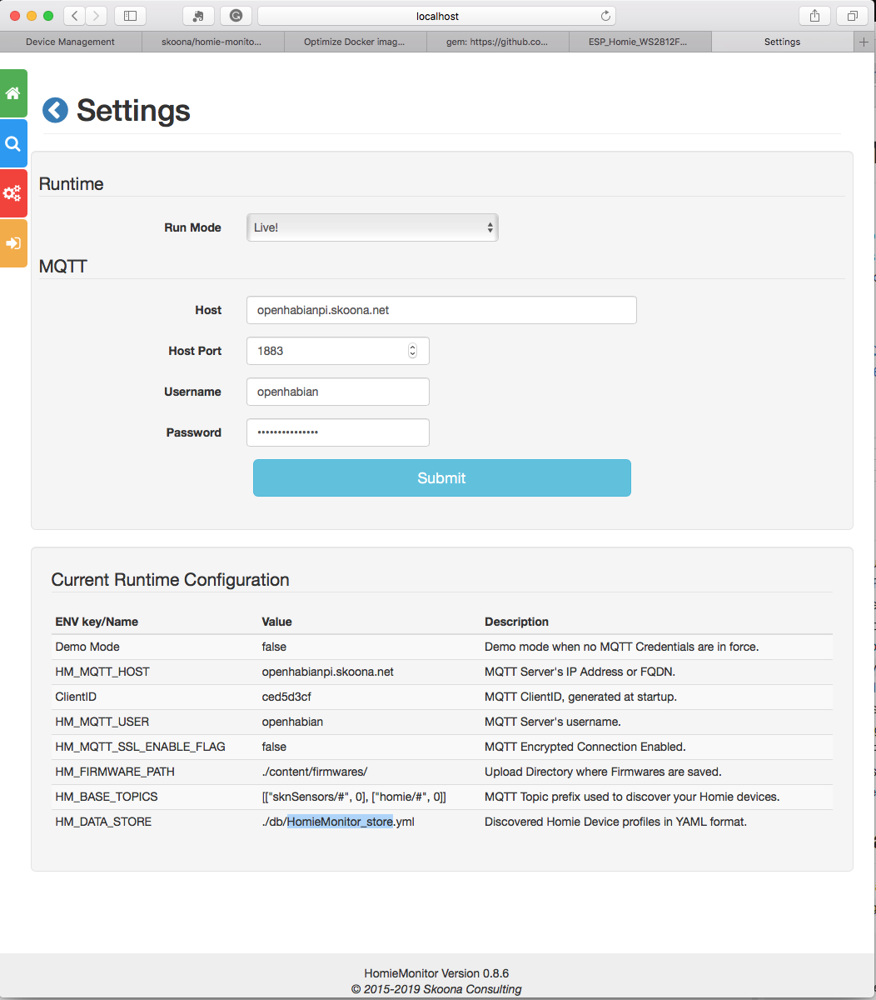

# HomieMonitor
[](https://hub.docker.com/r/skoona/homie-monitor)

An exploration into [Homie-esp8266](https://homieiot.github.io/homie-esp8266/docs/develop/quickstart/getting-started/), using modules from [Dry-RB](http://dry-rb.org), 
[Paho.MQTT.Ruby](https://github.com/RubyDevInc/paho.mqtt.ruby), [JRuby](https://www.jruby.org) and 
[Roda](https://github.com/jeremyevans/roda) tooling.  This application is designed to act as a `Homie Controller`, or `Monitor`, 
in support of IOT/Devices using [Homie-esp8266](https://github.com/homieiot/homie-esp8266); although any `Homie Device` implementation should be supported.

#### References: 
* [Homie: An MQTT Convention for IOT/M2M](https://homieiot.github.io/specification/)
* [Homie-ESP8266 Example of RCWL-0516 Microwave Presence Detector and DHT22 Temperature and Humidity sensors](https://github.com/skoona/sknSensors-Rcwl_Dht22)

#### Screenshots
| | | |
|:-------------------------:|:-------------------------:|:-------------------------:|
||||
||||
|||
 
## Features
* Device Discovery for version 2+ devices.
* Real-Time Status of all dicovered devices.
* Stale Device deletion (from MQTT) for decommissioned Homie Devices.
* Scheduled MQTT/OTA by device. binary or base64 flavored.
* Homie Image upload and retention.
* Ad-Hoc messaging to any device.
* In-App Configuration
* Current Device Inventory stored in YAML file.
* Docker, JRuby, MRI/Ruby runtime.


## Configuration and Demonstration Mode
The configuration module will prefer `environment`, or `in-app` settings over the `internal settings files` values in that order.  The default runtime state is `demonstration mode`, which uses a stored collection of test messages from mosquitto_sub for V2 and V3 devices.
The ***In-App Settings page*** is the quickest way to configure the application to your environment and is preferred.

Configuring for:
* Java warFile use `environment` vars. 
* JRuby or Ruby use `in-app` settings page.  
* Docker use `in-app` page or `environment` vars.


## Installation
#### (a) Ruby/JRuby
    Setup Application and Create Directories
        Edit .ruby-version and remove Gemfile.lock, and vendor directory if changing rubies
        `$ bin/setup`
    Start Server with Puma, Port 8585:
        `$ bundle exec puma config.ru -v`
    Start Console with Pry:</dt>
        `$ bin/console`

#### (b) Java [HomieMonitor warFile and script](https://www.dropbox.com/sh/xpv5a6gyexthnev/AAB0eY59kxTsMQJg7FOT3Pw9a?dl=0)
    Download warFile and `homieMonitor.sh`
        homie_monitor_esp-<version>.war and homieMonitoer.sh	    
    Edit `homieMonitor.sh` script
        set your mqtt credentials
    Start the app on port 8585
        $ homieMonitor

#### Configuration Environment Vars
The configuration module will prefers environment variables over all other methods. Don't use unless needed.

    RACK_ENV            defaults to `'production'`          UI Performance is greater with `production`
    HM_MQTT_HOST        defaults are invalid                Absence will force :demo_mode, unless using yaml configs or In-App overrides
    HM_MQTT_PORT        defaults to 1883
    HM_MQTT_USER        defaults are invalid
    HM_MQTT_PASS        defaults are invalid
    HM_BASE_TOPICS      defaults to `'[["sknSensors/#",0],["homie/#",0]]'`

    HM_MQTT_SSL_ENABLE_FLAG defaults to false
    HM_MQTT_SSL_CERT_PATH   defaults are invalid
    HM_MQTT_SSL_KEY_PATH    defaults are invalid

    HM_MQTT_LOG         defaults to empty (not nil)
    HM_FIRMWARE_PATH    defaults to './content/firmwares/'
    HM_SPIFFS_PATH      defaults to './content/spiffs/'
    HM_DATA_STORE       defaults to './content/db/HomieMonitor_store.yml'
    HM_OTA_TYPE         binary, base64strict, base64, RFC4648_pad, RFC4648_no_pad 
                        - are the content choices for OTA transmissions; defaults to `binary`

#### Example Bash script [homieMonitor.sh](https://www.dropbox.com/sh/xpv5a6gyexthnev/AAB0eY59kxTsMQJg7FOT3Pw9a?dl=0)

<details><summary>homieMonitor.sh</summary>
<p>

```bash
#!/bin/bash

# ##
# Setup HomieMonitor Java executable
# - Ref: https://github.com/skoona/HomieMonitor
#
# ##
#  Description
#  ----------------------------------------------
# RACK_ENV='production'         Use `production` for UI performance, or `development` for debug logging
# HM_MQTT_HOST='<mqtt-server-fqdn-or-ip_address>'
# HM_MQTT_PORT=<mqtt-connection-port>
# HM_MQTT_USER='<mqtt-username>'
# HM_MQTT_PASS='<mqtt-user-password>'
# HM_MQTT_SSL_ENABLE_FLAG defaults to false
# HM_MQTT_SSL_CERT_PATH   defaults are invalid, full-path required if ssl=true
# HM_MQTT_SSL_KEY_PATH    defaults are invalid, full-path required if ssl=true
# HM_BASE_TOPICS='[["sknSensors/#",0],["homie/#",0]]'   base mqtt message name <homie>/<device-id>/<node-id>/...
# HM_MQTT_LOG=`./log/paho-debug.log`        extra mqtt specific logfile, from paho-mqtt-ruby.gem
# HM_FIRMWARE_PATH="$HOME/homieMonitor/content/firmwares/"      Directory to store uploaded homie Firmware
# HM_DATA_STORE="$HOME/homieMonitor/content/db/HomieMonitor_store.yml"  Full path and filename of YAML storage of OTA Subscriptions
# HM_OTA_TYPE='base64strict'          binary, base64strict, base64, RFC4648_pad, RFC4648_no_pad
#                                     - are the choice for OTA transmissions; defaults to `binary`
#
# Special Paths
# 1. with HM_MQTT_SSL_CERT_PATH & HM_MQTT_SSL_KEY_PATH value empty `''`, set HM_MQTT_SSL_ENABLE_FLAG='true'
# 2. if above fails then certs are required.  populate HM_MQTT_SSL_CERT_PATH & HM_MQTT_SSL_KEY_PATH with proper file paths
#
# export RACK_ENV HM_MQTT_HOST HM_MQTT_PORT HM_MQTT_USER HM_MQTT_PASS 
# export HM_OTA_TYPE HM_MQTT_SSL_ENABLE_FLAG HM_MQTT_SSL_CERT_PATH HM_MQTT_SSL_KEY_PATH
# export HM_BASE_TOPICS HM_MQTT_LOG HM_FIRMWARE_PATH HM_DATA_STORE 

# Make runtime dirs
[ -w $HOME/homieMonitor/ ] || {
	echo 'Setting Up HomieMonitor' ;	 
	mkdir -p $HOME/homieMonitor/{content/firmwares,content/spiffs,content/db,bin,log,tmp,tmp/pids} ;
}

# Set Environment Vars
RACK_ENV='production'

# Export Environment (not required)
export RACK_ENV  

# copy homie_monitor-<version>.war to bin directory
# cp -v $HOME/Downloads/homie_monitor-<version>.war $HOME/homieMonitor/bin/

# Java warFile execution
java -Dwarbler.port=8585 -jar $HOME/homieMonitor/bin/homie_monitor_esp-<version>.war

#end

```

</p>
</details>


## Alternate Builds
### Switch Ruby
To use MRI edit `.ruby-version` and change `jruby-9.2.6.0` to `ruby-2.6.2`, before proceeding.

### Docker Compose
  To simplify startup instance of the container use [Docker Compose](https://docs.docker.com/compose/). 
  
  We provide sample of [docker-compose.yml](docker-compose.yml) which could be used to start the container with one comand in the same directory where docker-compose.yml is stored:

        $ docker-compose up

  In the compose file the binding of the Docker volumes is defined to retain the data of the application in `./srv`.

### Docker Container
* Primary [Docker Container](https://cloud.docker.com/repository/registry-1.docker.io/skoona/homie-monitor)

        $ docker build -t homie-monitor .

* Run created Container in DEMO mode:

	    $ docker run -it -p 8585:8585 --name my-homie-monitor homie-monitor

* Run created Container connected to your MQTT-Server:

  You have to pass **environment variables** for **MQTT hostname** and **port** within run script.

	    $ docker run -it -p 8585:8585 -e HM_MQTT_HOST=<hostname|ip> -e HM_MQTT_PORT=<port> --name my-homie-monitor homie-monitor

* Browse `http://<host>:8585/`

    If you want to retaint the data of HomieMonitor you have to bind the volumes of the container to the host using parameter on `docker run`. E.g.:

        --mount type=volume,source=./srv/homieMonitor/content,target=/usr/src/app/content

## Contributors

* Docker configuration contributed by Stephan Strittmatter @stritti on DockerHub, Gitter.
* Qos = 0 configuration value contributed by Marcus Klein @kleini on Gitter.


## Contributing

1. Fork it
2. Create your feature branch (`git checkout -b my-new-feature`)
3. Commit your changes (`git commit -am 'Add some feature'`)
4. Push to the branch (`git push origin my-new-feature`)
5. Create a new Pull Request

Find me on Gitter!

## License

The application is available as open source under the terms of the [MIT License](http://opensource.org/licenses/MIT).
